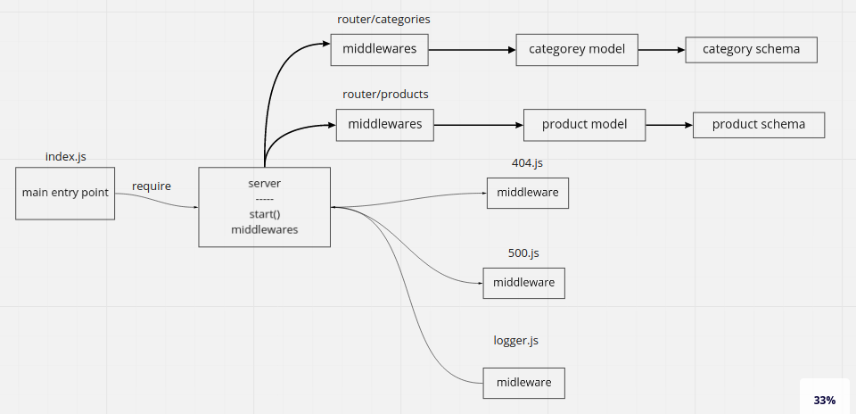

# lab8

# UML

# Swagger Doc
https://app.swaggerhub.com/apis/test2027/default-title/0.1

## Classes

<dl>
<dt><a href="#Category">Category</a></dt>
<dd></dd>
<dt><a href="#Product">Product</a></dt>
<dd></dd>
</dl>

## Functions

<dl>
<dt><a href="#create">create(record)</a> ⇒ <code>promise</code></dt>
<dd>
[create description]

</dd>
<dt><a href="#get">get(_id, category)</a> ⇒ <code>promise</code></dt>
<dd>
[get description]

</dd>
<dt><a href="#update">update(_id, record)</a> ⇒ <code>promise</code></dt>
<dd>
[update description]

</dd>
<dt><a href="#delete">delete(_id)</a> ⇒ <code>promise</code></dt>
<dd>
[delete description]

</dd>
<dt><a href="#create">create(record)</a> ⇒ <code>promise</code></dt>
<dd>
[create description]

</dd>
<dt><a href="#get">get(_id, category)</a> ⇒ <code>promise</code></dt>
<dd>
[get description]

</dd>
<dt><a href="#update">update(_id, record)</a> ⇒ <code>promise</code></dt>
<dd>
[update description]

</dd>
<dt><a href="#delete">delete(_id)</a> ⇒ <code>promise</code></dt>
<dd>
[delete description]

</dd>
</dl>

## Category
**Kind**: global class  

## Product
**Kind**: global class  

## create(record) ⇒ <code>promise</code>
[create description]

**Kind**: global function  

| Param | Type |
| --- | --- |
| record | <code>object</code> |

## get(_id, category) ⇒ <code>promise</code>
[get description]

**Kind**: global function  

| Param | Type |
| --- | --- |
| _id | <code>number</code> |
| category | <code>string</code> |

## update(_id, record) ⇒ <code>promise</code>
[update description]

**Kind**: global function  
**Returns**: <code>promise</code> - [description]  

| Param | Type | Description |
| --- | --- | --- |
| _id | <code>number</code> | [description] |
| record | <code>object</code> | [description] |

## delete(_id) ⇒ <code>promise</code>
[delete description]

**Kind**: global function  
**Returns**: <code>promise</code> - [description]  

| Param | Type | Description |
| --- | --- | --- |
| _id | <code>number</code> | [description] |

## create(record) ⇒ <code>promise</code>
[create description]

**Kind**: global function  

| Param | Type |
| --- | --- |
| record | <code>object</code> |

## get(_id, category) ⇒ <code>promise</code>
[get description]

**Kind**: global function  

| Param | Type |
| --- | --- |
| _id | <code>number</code> |
| category | <code>string</code> |

## update(_id, record) ⇒ <code>promise</code>
[update description]

**Kind**: global function  
**Returns**: <code>promise</code> - [description]  

| Param | Type | Description |
| --- | --- | --- |
| _id | <code>number</code> | [description] |
| record | <code>object</code> | [description] |

## delete(_id) ⇒ <code>promise</code>
[delete description]

**Kind**: global function  
**Returns**: <code>promise</code> - [description]  

| Param | Type | Description |
| --- | --- | --- |
| _id | <code>number</code> | [description] |
